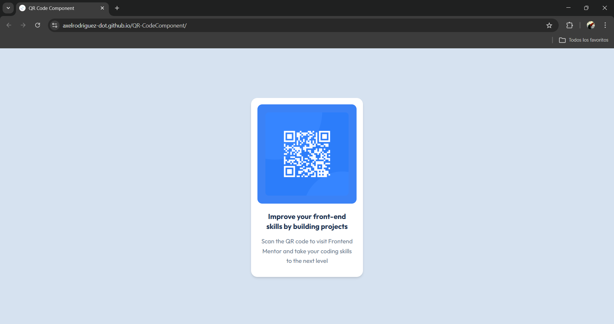

# 🧩 Proyecto: Componente QR Code

Este proyecto consiste en el desarrollo de un **componente de Código QR** utilizando **Astro** y **Tailwind CSS**.  
El objetivo es aplicar los conocimientos sobre **componentes**, **maquetación**, **estilos responsivos** y **utilidades CSS** para construir un diseño limpio, moderno y adaptable a diferentes dispositivos.

---

## 📖 Descripción general

### 🧩 Vista previa del proyecto
Agrega aquí una **captura de pantalla** del resultado final de tu componente.  
> Puedes usar la herramienta de captura del navegador o cualquier software de tu preferencia.

---

### 🔗 Enlaces del proyecto

- **Repositorio en GitHub:** [https://github.com/AxelRodriguez-dot/QR-CodeComponent](https://github.com/)
- **Sitio desplegado (opcional):** [https://axelrodriguez-dot.github.io/QR-CodeComponent/](https://)

---

## 🧠 Proceso de desarrollo

### 🛠️ Tecnologías utilizadas
Lista las herramientas y tecnologías que utilizaste en el proyecto. Por ejemplo:

- [Astro](https://astro.build)
- [Tailwind CSS](https://tailwindcss.com/)
- HTML5 semántico
- Diseño responsivo (Mobile-first)
- Componentes reutilizables

---

### 💡 Lo que aprendí
En esta sección describe brevemente **qué aprendiste o reforzaste** al desarrollar este proyecto.  
Puedes incluir fragmentos de código o mencionar conceptos nuevos que aplicaste.

Ejemplo:
Aprendi el como se utiliza tailwind a pesar de ser un poco tedioso de usar con los componentes es muy util en la creacion de paginas

### 🚀 Áreas de mejora

Mi entendimiento de tailwind y astro puesto que batalle bastante para que este pudiera funcionar

### 📚 Recursos útiles

**Ejemplo:**
- [Documentación de Astro](https://docs.astro.build)  
- [Guía oficial de Tailwind CSS](https://tailwindcss.com/docs)  
- [MDN Web Docs - HTML y CSS](https://developer.mozilla.org/es/)  
- [Guía de diseño responsivo](https://web.dev/responsive-web-design-basics/)  

---

### 👩‍💻 Autor

- **Nombre completo: Axel Johab Rodriguez Ortiz**  
- **Carrera:TICS**  
- **Grupo: 11-12**  
- **Correo institucional:23151212@aguascalientes.tecnm.mx**  

---

### ✨ Reflexión final

Comparte brevemente tu experiencia durante el desarrollo del proyecto.  
Puedes responder a preguntas como:

- ¿Qué fue lo más fácil o lo más difícil de realizar?  El sistema de componentes de astro
- ¿Qué parte disfrutaste más del desarrollo?  Ninguna es un dolor trabajar en estos
- ¿Qué conceptos nuevos aprendiste?  
- ¿Cómo aplicarías lo aprendido en proyectos futuros?
